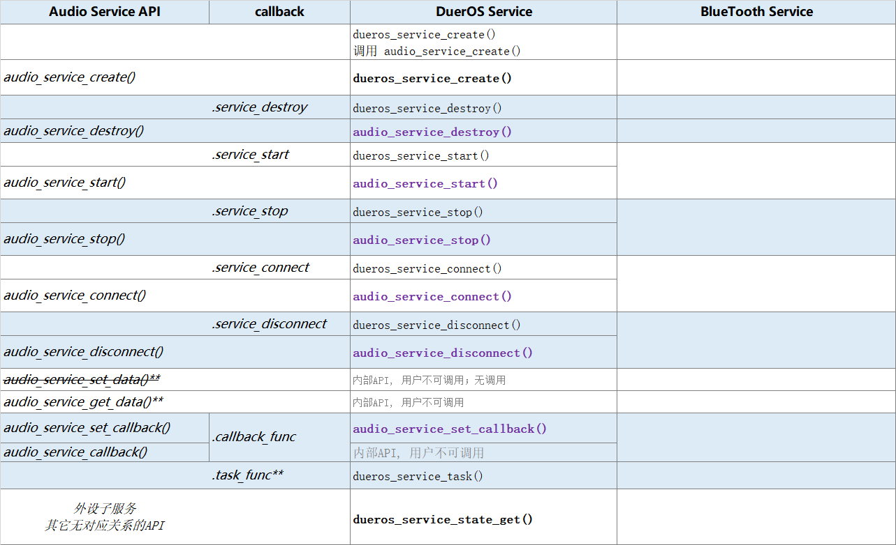
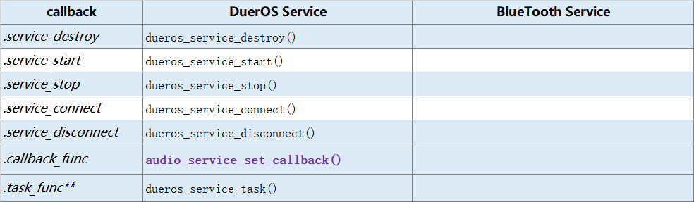
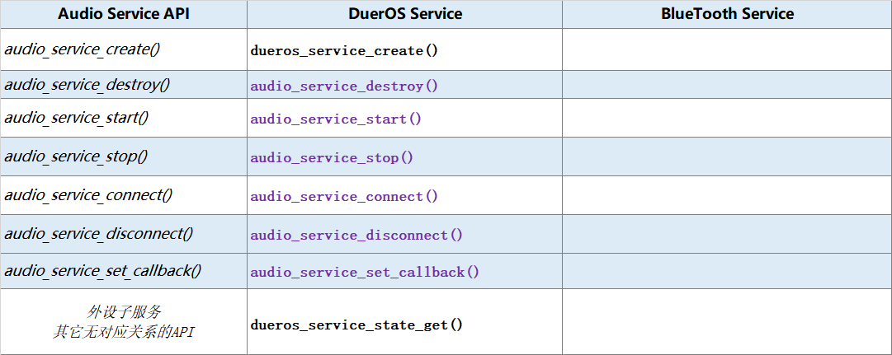

音频服务 Audio Service
#######################################

.. tip:: 

    如果图片看不清楚。你可以 **在图片上点击鼠标右键** --> **在新标签页中打开图片** ，然后你可以放大、缩小、移动图片。

`audio_service.c`__.

.. __: https://github.com/espressif/esp-adf/blob/master/components/esp_dispatcher/audio_service.c

.. role:: strike
   :class: strike

概述
=========

**音频服务** Audio Servcie，可能是为 DuerOS Servcie、BlueTooth Service 等 **音频子服务** 提供一个框架 —— 前者是父类，后者是子类。

但实际上，只有 DuerOS Servcie 是按 Audio Servcie 这个框架实现的；BlueTooth Service 则 与 Audio Servcie 相差甚远。

当前的代码实现（如 DuerOS Service），后者实现时基本上完全覆盖（或继承）前者的方法 —— **除了创建 Create 与特殊 API 要调用音频子服务的API；一般都调用音频服务的 API** 。

类图
=========

.. uml::

    caption Audio Servcie 类图

    class Audio_Service {
        __ audio_service_impl_t __
        -service_ctrl service_destroy;
        -service_ctrl service_start;
        -service_ctrl service_stop;
        -service_ctrl service_connect;
        -service_ctrl service_disconnect;
        -service_cb   callback_func;
        -void*        user_cb_ctx;
        -void*        user_data;

        __ public method __
        +audio_service_create()
        +audio_service_destroy()
        +audio_service_start()
        +audio_service_stop()
        +audio_service_ioctl()
        +audio_service_set_callback()
        +audio_service_callback()
        +audio_service_connect()
        +audio_service_disconnect()
        +audio_service_set_data()
        +audio_service_get_data()
    }

我们用类图的形式，描述音频服务 Audio Servcie 的实现（实际上代码是用 C 语言实现的）：

* 结构体 ``audio_service_impl_t`` ，是内部私有数据。

    * ``.service_destroy``: 销毁服务的回调函数。
    * ``.service_start``: 启动服务的回调函数。
    * ``.service_stop``: 停止服务的回调函数。
    * ``.service_connect``: 连接服务的回调函数。
    * ``.service_disconnect``: 断开服务的回调函数。
    * ``.callback_func``: 事件处理的回调函数。
    * ``.user_cb_ctx``: ``callback_func`` 的参数。
    * ``.user_data``: 存放音频子服务的数据。

* **public method** 部分，是 Audio Servcie 的提供的 API 函数。这些函数的实现大部分都很简单:

    * ``audio_service_create()`` 的实现略微复杂一点，看这里  `API`_ 。
    * ``audio_service_destroy()`` 执行回调函数 ``.service_destroy`` 。
    * ``audio_service_start()`` 执行回调函数 ``.service_start`` 。
    * ``audio_service_stop()`` 执行回调函数 ``.service_stop`` 。
    * ``audio_service_connect()`` 执行回调函数 ``.service_connect`` 。
    * ``audio_service_disconnect()`` 执行回调函数 ``.service_disconnect`` 。
    * ``audio_service_set_callback()`` 设置回调函数 ``.callback_func`` 及 上下文 ``user_cb_ctx`` 。
    * ``audio_service_callback()`` 执行回调函数 ``.callback_func`` 。
    * ``audio_service_set_data()`` 设置变量 ``.user_data`` 。实际上大部分时候都是在 ``audio_service_create()`` 里设置 ``.user_data``  。 **此函数可能有缺陷** 。
    * ``audio_service_get_data()`` 获取变量 ``.user_data`` 。

序列图
=============

.. uml::

    caption Audio Servcie 序列图

    box "xxx_app"
    participant "xxx_app.c"         as adf_app  order 10
    end box

    box "esp_dispatcher" #LightBlue
    participant "audio_service.c"  as audio_service  order 20
    end box

    box "xxx_service" 
    participant "xxx_service.c"   as xxx_service  order 30
    participant "xxx_service_task()" as service_task  order 40
    end box
      
    == Create audio service & set callback ==
    autonumber 1 "<b>(<u>##</u>)"
    adf_app        -> xxx_service : xxx_service_create()
    audio_service  <- xxx_service : audio_service_create({\n .service_destroy = xxx_service_destroy, \n .service_start = xxx_service_start, \n .service_stop = xxx_service_stop, \n .service_connect = dueros_connect, \n .service_disconnect = dueros_disconnect, \n .task_func  = xxx_service_task, \n .user_data = (void *)serv})

    alt .task_func!=NULL (实际上是 .task_stack > 0)
    audio_service -> service_task : xTaskCreatePinnedToCore({.task_func})
    activate service_task
    end

    adf_app      -> audio_service : audio_service_set_callback \n ({.callback_func=app_event_cb})
    audio_service  <- xxx_service : (--audio_service_set_data(data)--)

    == Connect audio service ==
    autonumber 10 "<b>(<u>##</u>)"
    adf_app       -> audio_service : audio_service_connect()
    alt .service_connect != NULL
    audio_service -> xxx_service   : .service_connect() \n ==> xxx_service_connect()
    end

    == Start audio service ==
    autonumber 20 "<b>(<u>##</u>)"
    adf_app       -> audio_service : audio_service_start()
    alt .service_start != NULL
    audio_service -> xxx_service  : .service_start() \n ==> xxx_service_start()
    end

    == Execute callback ==
    autonumber 30 "<b>(<u>##</u>)"
    service_task    <-] 
    audio_service  <- service_task : audio_service_callback()
    alt .callback_func != NULL
    adf_app       <- audio_service : .callback_func() \n ==> //app_event_cb()//
    end

    == Stop audio service ==
    autonumber 40 "<b>(<u>##</u>)"
    adf_app         -> audio_service : audio_service_stop()
    alt .service_stop != NULL
    audio_service   -> xxx_service   : .service_stop() \n ==> xxx_service_stop()
    end

    == Disconnect audio service ==
    autonumber 50 "<b>(<u>##</u>)"
    adf_app       -> audio_service : audio_service_disconnect()
    alt .service_disconnect != NULL
    audio_service -> xxx_service   : .service_disconnect() \n ==> xxx_service_disconnect()
    end

    == Destory audio service ==
    autonumber 60 "<b>(<u>##</u>)"
    adf_app        -> audio_service : audio_service_destroy()
    alt .service_desotry != NULL
    audio_service  -> xxx_service  : .service_desotry() \n ==> xxx_service_destory()    
    xxx_service    -> service_task : (destory task)
    deactivate service_task 
    end

**对像说明：**

* **xxx_app.c**: 某个用户程序
* **xxx_service.c**: 某个音频子服务
* **xxx_service_task()**: 音频子服务的内部任务
* **audio_service.c**：音频服务

**流程说明：**

1. xxx_app.c 调用某个音频子服务 ``xxx_service_create()``。

2. xxx_service.c 调用 ``audio_service_create()``, 并会将 ``.service_destroy`` ， ``.service_start`` , ``.service_stop`` , ``.service_connect`` , ``.service_disconnect`` ,  等回调函数作为参数的字段传入。 同时也会将自已的地址，作为 ``.user_data`` 参数字段传入。 若音频子服务需要创建内部任务，则会将内部任务函数作为 ``.task_func`` 参数字段传入。

3. audio_service.c 将上述回调函数和 ``.user_data`` 保存下来。若 ``.task_func`` 不为空(实际上是 ``.task_stack > 0``)，则创建内部任务。

4. 若有需要，xxx_app.c 调用 ``audio_service_set_callback()`` 设置事件回调函数 ``.callback_func`` 。

5. ``audio_service_set_data()`` 此函数有缺陷，且实际上没有调用过。

10. xxx_app.c 调用 ``audio_service_connect()``。
11. 若 ``.service_connect`` 不为空，则会被执行。

20. xxx_app.c 调用 ``audio_service_start()``。
21. 若 ``.service_start`` 不为空，则会被执行。

30. 内部任务 xxx_service_task() 收到外部事件。
31. 内部任务 xxx_service_task() 调用 ``audio_service_callback()`` 。
32. 若 ``.callback_func`` 不为空， 则会被执行。

40. xxx_app.c 调用 ``audio_service_stop()``。
41. 若 ``.service_stop`` 不为空，则会被执行。

50. xxx_app.c 调用 ``audio_service_discconect()``。
51. 若 ``.service_discconect`` 不为空，则会被执行。

60. xxx_app.c 调用 ``audio_service_destroy()``, 销毁某个音频子服务。
61. 若 ``.service_destroy`` 不为空， 则会被 audio_service.c 调用。
62. xxx_service.c 中止内部任务 xxx_service_task() 。

    *DuerOS Service 是 60, 61, 62 流程。*

.. note::

    上述流程只表示一般做法。各音频子服务的实现，可能与上述流程并不完全一致。

API
=========

* audio_service_create()

    .. uml::

        box "xxx_app"
        participant "xxx_app.c"         as adf_app  order 10
        end box

        box "esp_dispatcher" #LightBlue
        participant "audio_service.c"  as audio_service  order 20
        end box

        box "xxx_service" 
        participant "xxx_service.c"   as xxx_service  order 30
        participant "xxx_service_task()" as service_task  order 40
        end box
        
        == Create audio service & set callback ==
        autonumber 1 "<b>(<u>##</u>)"
        adf_app        -> xxx_service : xxx_service_create()
        audio_service  <- xxx_service : audio_service_create({\n .service_destroy = xxx_service_destroy, \n .service_start = xxx_service_start, \n .service_stop = xxx_service_stop, \n .service_connect = dueros_connect, \n .service_disconnect = dueros_disconnect, \n .task_func  = xxx_service_task, \n .user_data = (void *)serv})

        alt .task_func!=NULL (实际上是 .task_stack > 0)
        audio_service -> service_task : xTaskCreatePinnedToCore({.task_func})
        activate service_task
        end

        adf_app      -> audio_service : audio_service_set_callback \n ({.callback_func=app_event_cb})
        audio_service  <- xxx_service : (--audio_service_set_data(data)--)

* audio_service_destroy()
* audio_service_start()
* audio_service_stop()
* audio_service_connect()
* audio_service_disconnect()
* audio_service_set_callback()
* audio_service_callback()
* audio_service_set_data()
* audio_service_get_data()

与音频子服务的映射
=================================================

完全映射
----------------------------

同时包括了 **回调函数映射** 与 **API映射** 。

   Audio  Service 与 各音频子服务的映射

说明：

* BlueTooth Service 不是基于 Audio Servcie 实现的，与相差甚远，**无法列出对应关系** 。 

* **黑色粗体与紫色粗体文字** ：用户可调用的 API 函数。
* **无调用** ：提供了API, 但在 ESP_ADF 中没有调用过。
* **内部API,用户不可调用** ：供音频子服务调用的API。
* **空函数**：内部实现为空，或基本为空。
* ``.task_func`` ： 这不是 callback, 只是 ``audio_service_create()`` 的参数的一个字段。若这个字段非空，则会创建一个音频子服务的内部任务。
* ``audio_service_set_data()`` ：没有任何地方调用。实际上也 **不能被调用** ，该函数修改的 ``.user_data`` 字段，在 ``audio_service_create()`` 中已经被赋值了。

* ``audio_service_get_data()`` ：为各音频子服务提供的内部 API，用户不应该调用。	

回调函数映射
-----------------------------

   Audio  Service 与 各音频子服务的回调函数映射

API 映射
----------------------------

   Audio  Service 与 各音频子服务的 API 映射

上表进一步说明了如下原则： **除了创建 Create 与特殊 API 要调用音频子服务的API；一般都调用音频服务的 API** 。

