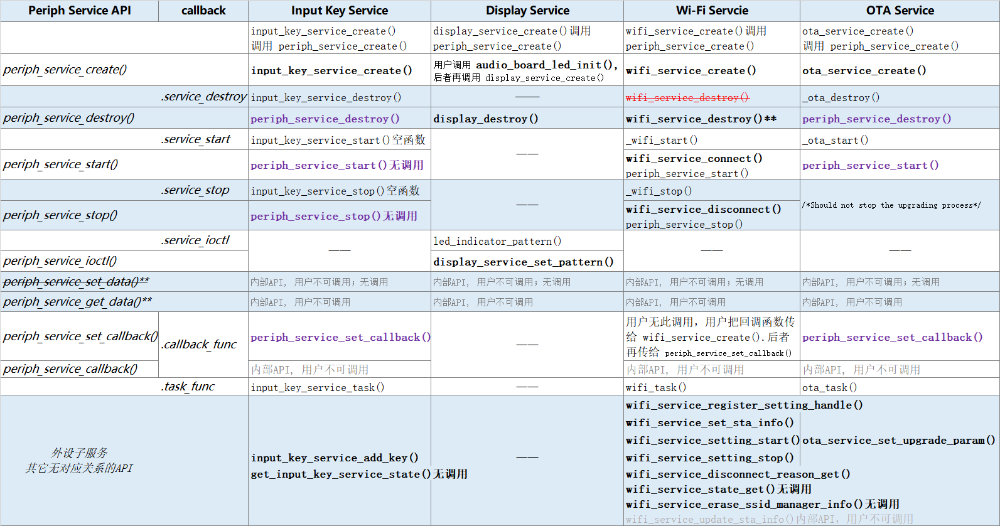
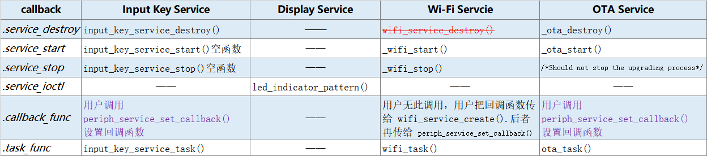
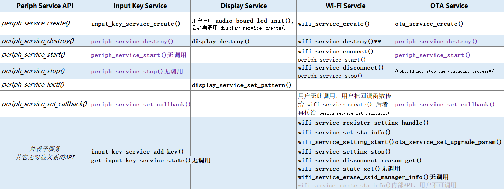

外设服务 Periph Service
################################

.. tip:: 

    如果图片看不清楚。你可以 **在图片上点击鼠标右键** --> **在新标签页中打开图片** ，然后你可以放大、缩小、移动图片。

`periph_service.c`__.

.. __: https://github.com/espressif/esp-adf/blob/master/components/esp_dispatcher/periph_service.c

1. 概述
=========

**外设服务** Periph Servcie，是为 OTA Service、Input Key Servcie 等 **外设子服务** 提供一个框架 —— 前者是父类，后者是子类。

但是当前的代码实现，后者实现时并没有完全覆盖（或继承）前者的方法 —— 用户有些 API 需要调用后者的，有些 API 仍然需要调用前者的。

大致的原则：**优先调用外设子服务的API；否则调用外设服务的API（这时需要注意外设子服务是如何实现的）。**

2. 类图
=========

.. uml::

    caption Periph Servcie 类图

    class periph_service_impl_t {
        __ private data __
        -periph_service_ctrl service_destroy;
        -periph_service_ctrl service_start;
        -periph_service_ctrl service_stop;
        -periph_service_io   service_ioctl;
        -periph_service_cb   callback_func;
        -void*               user_cb_ctx;
        -void*               user_data;

        __ public method __
        +periph_service_create()
        +periph_service_destroy()
        +periph_service_start()
        +periph_service_stop()
        +periph_service_ioctl()
        +periph_service_set_callback()
        +periph_service_callback()
        +periph_service_set_data()
        +periph_service_get_data()
    }

我们用类图的形式，描述外设服务 Periph Servcie 的实现（实际上代码是用 C 语言实现的）：

* **private data** 部分，是结构体 ``periph_service_impl_t`` 的主要字段。

* **public method** 部分，是 Periph Servcie 的提供的 API 函数。这些函数的实现大部分都很简单:

    * ``periph_service_create()`` 的实现略微复杂一点，看这里  `4. API`_ 。
    * ``periph_service_destroy()`` 执行回调函数 ``.service_destroy`` 。
    * ``periph_service_start()`` 执行回调函数 ``.service_start`` 。
    * ``periph_service_stop()`` 执行回调函数 ``.service_stop`` 。
    * ``periph_service_ioctl()`` 执行回调函数 ``.service_ioctl`` 。
    * ``periph_service_set_callback()`` 设置回调函数 ``.callback_func`` 及 上下文 ``user_cb_ctx`` 。
    * ``periph_service_callback()`` 执行回调函数 ``.callback_func`` 。
    * ``periph_service_set_data()`` 设置变量 ``.user_data`` 。实际上大部分时候都是在 ``periph_service_create()`` 里设置 ``.user_data`` 。 **此函数可能有缺陷** 。
    * ``periph_service_get_data()`` 获取变量 ``.user_data`` 。

3. 序列图
============

.. uml::

    caption Periph Servcie 序列图

    box "xxx_app"
    participant "xxx_app.c"         as adf_app  order 10
    end box

    box "xxx_service" 
    participant "xxx_service.c"   as xxx_service  order 20
    participant "xxx_service_task()" as service_task  order 30
    end box

    box "esp_dispatcher" #LightBlue
    participant "periph_service.c"  as periph_service  order 40
    end box
      
    == Create peripheral service & set callback ==
    autonumber 1 "<b>(<u>##</u>)"
    adf_app        -> xxx_service : xxx_service_create \n (--{.callback=app_event_cb}--)
    xxx_service -> periph_service : periph_service_create({\n .service_destroy = xxx_service_destroy, \n .service_start = xxx_service_start, \n .service_stop = xxx_service_stop, \n .service_ioctl = xxx_service_ioctl, \n .task_func  = xxx_service_task, \n .user_data = (void *)serv})

    alt .task_func!=NULL (实际上是 .task_stack > 0)
    periph_service -> service_task : audio_thread_create({.task_func})
    activate service_task
    end

    adf_app        -> xxx_service : (other setting function)
    adf_app -> periph_service : periph_service_set_callback({.callback_func=app_event_cb})
    xxx_service -> periph_service : (--periph_service_set_data(data)--)

    == Start peripheral service ==
    autonumber 10 "<b>(<u>##</u>)"
    adf_app       -> periph_service : periph_service_start()
    alt .service_start != NULL
    xxx_service   <- periph_service : .service_start() ==> xxx_service_start()
    ...
    end

    == Execute callback ==
    autonumber 20 "<b>(<u>##</u>)"
    service_task    <-] 
    periph_service  <- service_task : periph_service_callback()
    alt .callback_func != NULL
    adf_app       <- periph_service : .callback_func() ==> //app_event_cb()//
    end

    == Stop peripheral service ==
    autonumber 30 "<b>(<u>##</u>)"
    adf_app         -> periph_service : periph_service_stop()
    alt .service_stop != NULL
    xxx_service     <- periph_service : .service_stop() ==> xxx_service_stop()
    end

    == Destory peripheral service (A) ==
    autonumber 40 "<b>(<u>##</u>)"
    adf_app        -> xxx_service : xxx_service_destroy()
    xxx_service    -> service_task : (destory task)
    deactivate service_task 
    xxx_service  -> periph_service : periph_service_destroy()

    == Destory peripheral service (B) ==
    autonumber stop
    periph_service -> service_task
    activate service_task 
    autonumber 50 "<b>(<u>##</u>)"
    adf_app        -> periph_service : periph_service_destroy()
    alt .service_desotry != NULL
    xxx_service     <- periph_service : .service_desotry() ==> xxx_service_destory()    
    xxx_service    -> service_task : (destory task)
    deactivate service_task 
    end

**对像说明：**

* **xxx_app.c**: 某个用户程序
* **xxx_service.c**: 某个外设子服务
* **xxx_service_task()**: 外设子服务的内部任务
* **periph_service.c**：外设服务

**流程说明：**

1. xxx_app.c 调用某个外设子服务 ``xxx_service_create()``。少数处设子服务（Wi-Fi Service）会将事件处理回调函数作为参数的字段传入。

2. xxx_service.c 调用 ``periph_service_create()``, 并会将 ``.service_destroy`` ， ``.service_start`` , ``.service_stop`` , ``.service_ioctl`` ,  等回调函数作为参数的字段传入。 同时也会将自已的地址，作为 ``.user_data`` 参数字段传入。 若外设子服务需要创建内部任务，则会将内部任务函数作为 ``.task_func`` 参数字段传。

3. periph_service.c 将上述回调函数和 ``.user_data`` 保存下来。若 ``.task_func`` 不为空(实际上是 ``.task_stack > 0``)，则创建内部任务。

4. xxx_app.c 调用其它函数，设置外设子服务参数。

5. 若有需要，xxx_app.c 调用 ``periph_service_set_callback()`` 设置事件回调函数 ``.callback_func`` （Wi-Fi Service 由 wifi_service.c调用）。

6. ``periph_service_set_data()`` 此函数有缺陷，且实际上没有调用过。

10. xxx_app.c 调用 ``periph_service_start()``。
11. 若 ``.service_start`` 不为空，则会被执行。

20. 内部任务 xxx_service_task() 收到外部事件。
21. 内部任务 xxx_service_task() 调用 ``periph_service_callback()`` 。
22. 若 ``.callback_func`` 不为空， 则会被执行。

30. xxx_app.c 调用 ``periph_service_stop()``。
31. 若 ``.service_stop`` 不为空，则会被执行。

40. xxx_app.c 调用 ``xxx_service_destory()``, 销毁某个外设子服务。
41. xxx_service.c 中止内部任务 xxx_service_task() 。
42. xxx_service.c 调用 ``periph_service_destroy()`` 。

    *Wi-Fi Servcie 与 Display Service 是 40，41，42 流程。*

50. xxx_app.c 调用 ``periph_service_destroy()``, 销毁某个外设子服务。
51. 若 ``.service_destroy`` 不为空， 则会被 periph_service.c 调用。
52. xxx_service.c 中止内部任务 xxx_service_task() 。

    *Input Key Service 与 OTA Service 是 50, 51, 52 流程。*

.. note::

    上述流程只表示一般做法。各外设子服务的实现，并不完全与上述流程保持一致。

4. API
=========

* periph_service_create()

    .. uml::

        caption Create Periph Servcie 序列图

        box "xxx_app"
        participant "xxx_app.c"         as adf_app  order 10
        end box

        box "xxx_service" 
        participant "xxx_service.c"   as xxx_service  order 20
        participant "xxx_service_task()" as service_task  order 30
        end box

        box "esp_dispatcher" #LightBlue
        participant "periph_service.c"  as periph_service  order 40
        end box
        
        == Create peripheral service & set callback ==
        autonumber 1 "<b>(<u>##</u>)"
        adf_app        -> xxx_service : xxx_service_create \n (--{.callback=app_event_cb}--)
        xxx_service -> periph_service : periph_service_create({\n .service_destroy = xxx_service_destroy, \n .service_start = xxx_service_start, \n .service_stop = xxx_service_stop, \n .service_ioctl = xxx_service_ioctl, \n .task_func  = xxx_service_task, \n .user_data = (void *)serv})

        alt .task_func!=NULL (实际上是 .task_stack > 0)
        periph_service -> service_task : audio_thread_create({.task_func})
        activate service_task
        end

        adf_app        -> xxx_service : (other setting function)
        adf_app -> periph_service : periph_service_set_callback({.callback_func=app_event_cb})
        xxx_service -> periph_service : (--periph_service_set_data(data)--)

* periph_service_destroy()
* periph_service_start()
* periph_service_stop()
* periph_service_ioctl()
* periph_service_set_callback()
* periph_service_callback()
* periph_service_set_data()
* periph_service_get_data()

5. 与外设子服务的映射
=================================================

5.1 完全映射
----------------------------

同时包括了 **回调函数映射** 与 **API映射** 。

   Periph Service 与 各外设子服务的映射

说明：

* **黑色粗体与紫色粗体文字** ：用户可调用的 API 函数。
* **无调用** ：提供了API, 但在 ESP_ADF 中没有调用过。
* **内部API,用户不可调用** ：供外设子服务调用的API。
* **空函数**：内部实现为空，或基本为空。
* ``.task_func`` ： 这不是 callback, 只是 ``periph_service_create()`` 的参数的一个字段。若这个字段非空，则会创建一个外设子服务的内部任务。
* ``periph_service_set_data()`` ：没有任何地方调用。实际上也 **不能被调用** ，该函数修改的 ``.user_data`` 字段，在 ``periph_service_create()`` 中已经被赋值了。

* ``periph_service_get_data()`` ：为各外设子服务提供的内部 API，用户不应该调用。	

* ``wifi_service_destroy()`` ：调用这个函数可能会 **出现异常** 。

    ``wifi_service_create()`` 调用 ``periph_service_create()`` 时，把 ``wifi_service_destroy()`` 作为参数字段 ``.service_destory`` 传递给后者了。按通用的作法 ``periph_service_destroy()`` 中会调用回调函数 ``.service_destory``，即 ``wifi_service_destroy()`` 。但 ``wifi_service_destroy()`` 的实现中，又会调用 ``periph_service_destroy()`` 。

    幸运的是，没有地方调用 ``wifi_service_destroy()``，Wi-Fi Service 的 ``periph_service_destroy()`` 方法，好像也没有地方调用。

    你可以自已修订这个bug： 把 ``.service_destroy = wifi_service_destroy,`` 修改为 ``.service_destroy = NULL,``" 。

5.2 回调函数映射
-----------------------------

   Periph Service 与 各外设子服务的回调函数映射

5.3 API 映射
----------------------------

   Periph Service 与 各外设子服务的 API 映射

